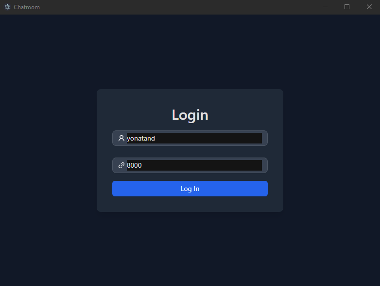
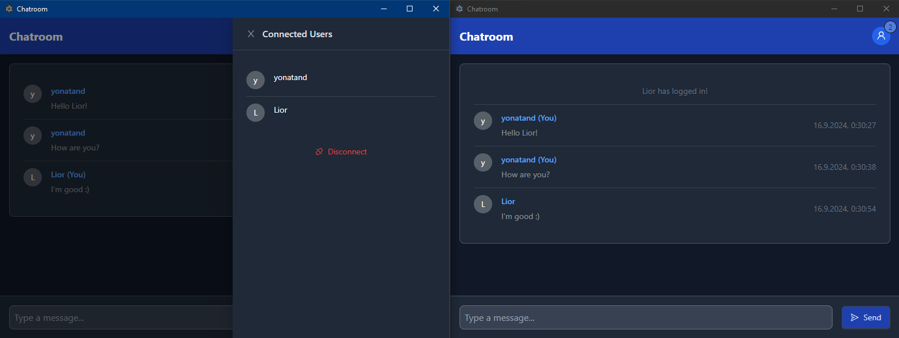
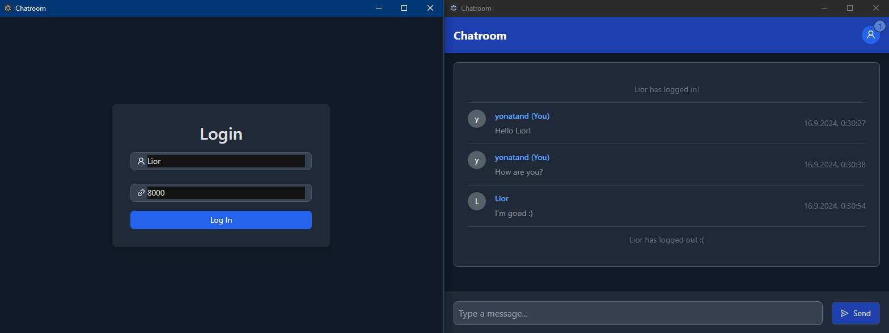
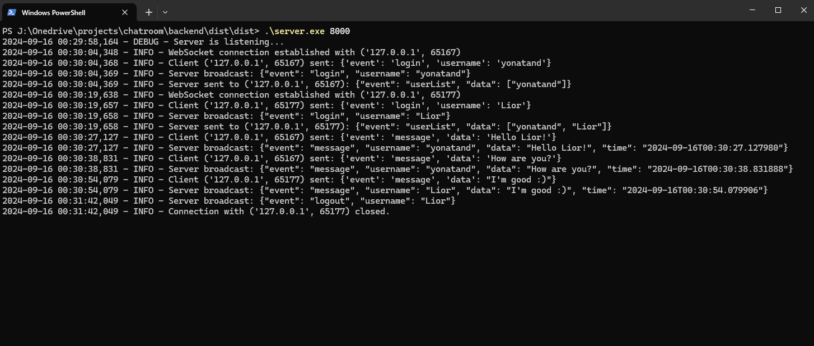

# Chatroom

Chatroom is a basic chatroom application with a frontend built using React, TypeScript, Vite, Ant Design (antd), Tailwind, Electron, and Bun. The backend is a Python server that communicates with the frontend using sockets.

## Project Structure

The repository is organized into two main folders:

- `frontend`: Contains the Electron app with the chatroom UI.
- `backend`: Contains the Python server that handles chatroom logic and communication.

## What the Chatroom Can Do

- **Login Page**: Users can enter their username and the port of the server they want to connect to. 

- **Real-Time Chat**: Users can engage in real-time conversations. When a user opens the connected users list, it shows the users currently online. 

- **User Disconnection**: If a user disconnects, the other clients are notified, and the disconnected user’s status is updated accordingly. 

- **Server Logs**: The server prints logs of various activities, providing insights into the server’s operation. 

- **Example Log File**: The server outputs log files that include details about server activities. You can view an example log file [here](readme/app-example.log)

## Frontend

The frontend of the chatroom is built with React and TypeScript. It utilizes Vite for development and builds, Ant Design for UI components, Tailwind for styling, and Electron for packaging the application.

### Getting Started

1. **Install Bun**

   Bun is required for managing the frontend dependencies and running the project. To install Bun, follow the instructions on the [Bun website](https://bun.sh) or use the following command:

   ```bash
   curl -fsSL https://bun.sh/install | bash
   ```

2. **Install Dependencies**

   Navigate to the `frontend` directory and run:

   ```bash
   bun install
   ```

3. **Run the Frontend Locally**

   Use the following command to start the Vite development server:

   ```bash
   bun run dev
   ```

4. **Build the Electron Executable**

   To build the Electron executable, use:

   ```bash
   bun run electron-build
   ```

   (You may need to run the command in Administrator Mode)

   The executable will be located in `frontend/dist`.

## Backend

The backend is a Python server that handles chatroom functionality. It is recommended to use Python 3.10.

### Getting Started

To run the backend server, navigate to the `backend` directory and use the following command:

```bash
python -m server.server <port>
```

### Building the Backend

1. Install `pyarmor` and `pyinstaller`:

   ```bash
   pip install pyarmor pyinstaller
   ```

2. Navigate to the `backend` directory and run:

   ```bash
   pyarmor gen -O dist -r server logs socket_manager
   ```

3. Change to the `dist` directory:

   ```bash
   cd dist
   ```

4. Build the executable using PyInstaller:

   ```bash
   pyinstaller --onefile --name server --hidden-import=pyarmor_runtime_00000 --hidden-import=json --hidden-import=socket_manager --add-data logs/*.py:logs --add-data socket_manager/*.py:socket_manager server/server.py
   ```

The executable will be located in `backend/dist/dist`.
